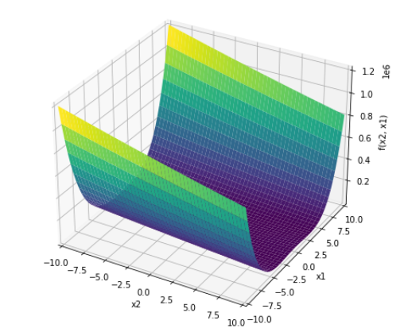
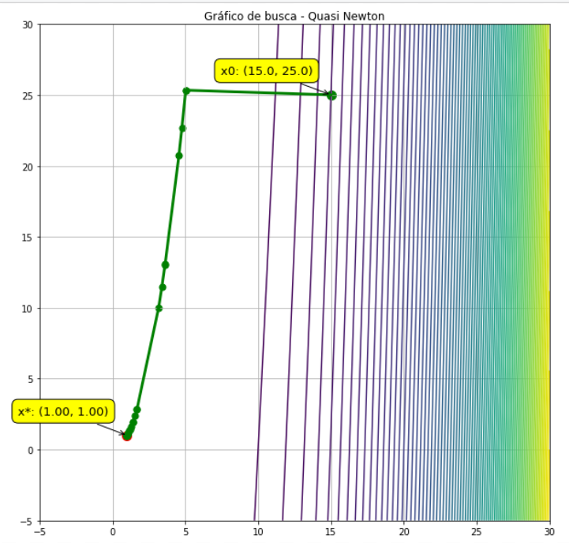
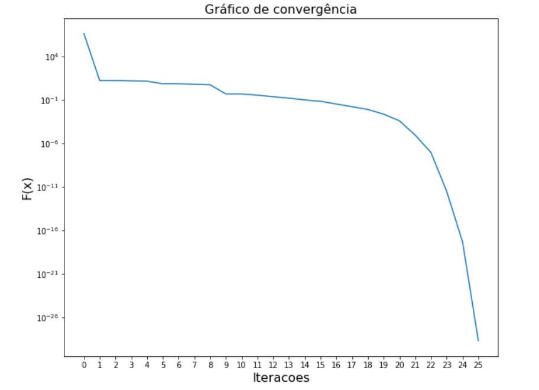
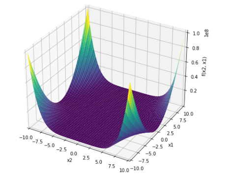
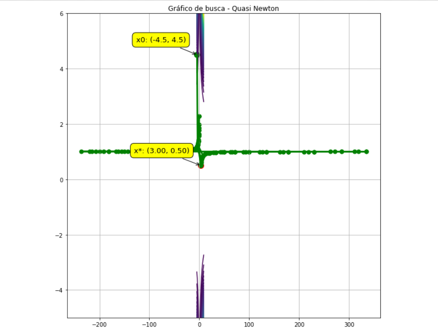
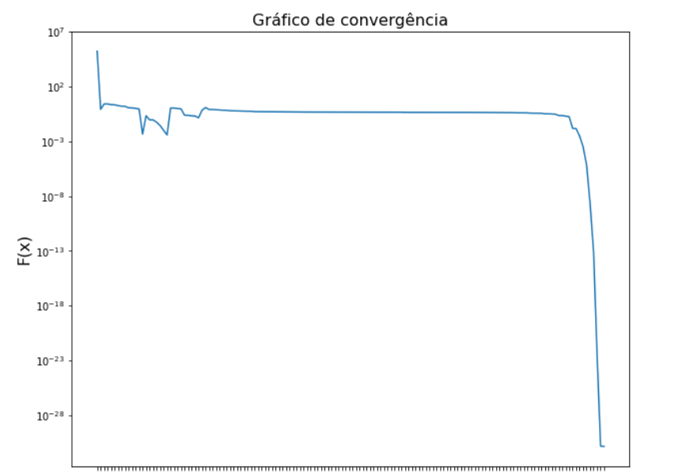

# Método de Direção de Busca: Quasi-Newton

Algoritmo definido utilizando conhecimentos adquiridos na disciplina de Otimização não Linear do Curso de Engenharia de Sistemas.

**Referência:**  Notas de aula do Prof. R. H. Takahashi

## Introdução

- Este método surge para suprir a deficiência do método de Newton para problemas mais complexos onde não conseguimos calcular a derivada ou  quando se torna um processo muito “caro”. 
- O método Quasi-Newton é basicamente o método de Newton, onde o cálculo da derivada é trocada por uma regra recursiva que permite a construção gradativa de uma matriz Hk que corresponde a uma estimativa da inversa da Hessiana da função objetivo.
- Correções no desvio e andamento da função realizados por Métodos DFP (Davidon-Fletcher-Powell) e o método BFGS (Broyden- Fletcher- Goldfarb- Shanno). Família de Broyden.

## Objetivo

Dado um problema de minimização linear irrestrito, utilizando o método de Quasi-Newton (Família de Broyden ) encontrar o ponto ótimo x*.

## Materiais e Metodologias

- O algoritmo foi desenvolvido em Python, utilizando o Jupyter Notebook e o Google Colab
- Para a construção do algoritmo foi utilizado as seguintes bibliotecas:
  1. Sympy (utiliza variáveis simbólicas e funções para manipular elas);
  2. Numpy (calcular multiplicação matricial) ;
  3. Matplotlib (plot dos gráficos);

## Exemplos

- Booth function: x0 = [-10, 10],  x* = [1, 3]
    
    f(x) = (x1+2*x2-7)^2 + (2*x1+x2 -5)^2
  

    

- **Rosenbrock Function**: x0 = [-5, 10],  x* = [1, 1]
    
    f(x) = 100*(x2-x1^2)^2+(x1-1)^2
    

- **Beale Function:** x0 = [-4.5,  4.5],   x* = [3, 0.5]
    
    f(x) = (1.5-x1+x1*x2)^2=(2.25-x1+x1*x2^2)^2+(2.625-x1+x1*x2^3)^2
    

